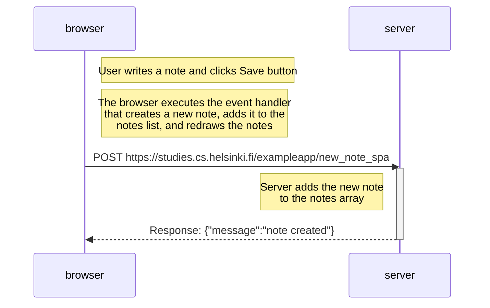

```mermaid
sequenceDiagram
    participant browser
    participant server

    Note right of browser: User writes a note and clicks Save button
    Note right of browser: The browser executes the event handler<br/>that creates a new note, adds it to the<br/>notes list, and redraws the notes

    browser->>server: POST https://studies.cs.helsinki.fi/exampleapp/new_note_spa
    activate server
    Note left of server: Server adds the new note<br/>to the notes array
    server-->>browser: Response: {"message":"note created"}
    deactivate server
```